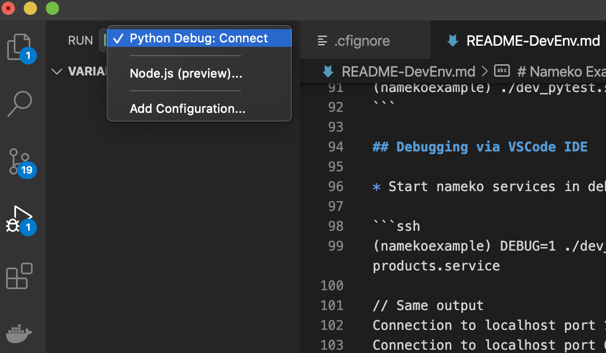
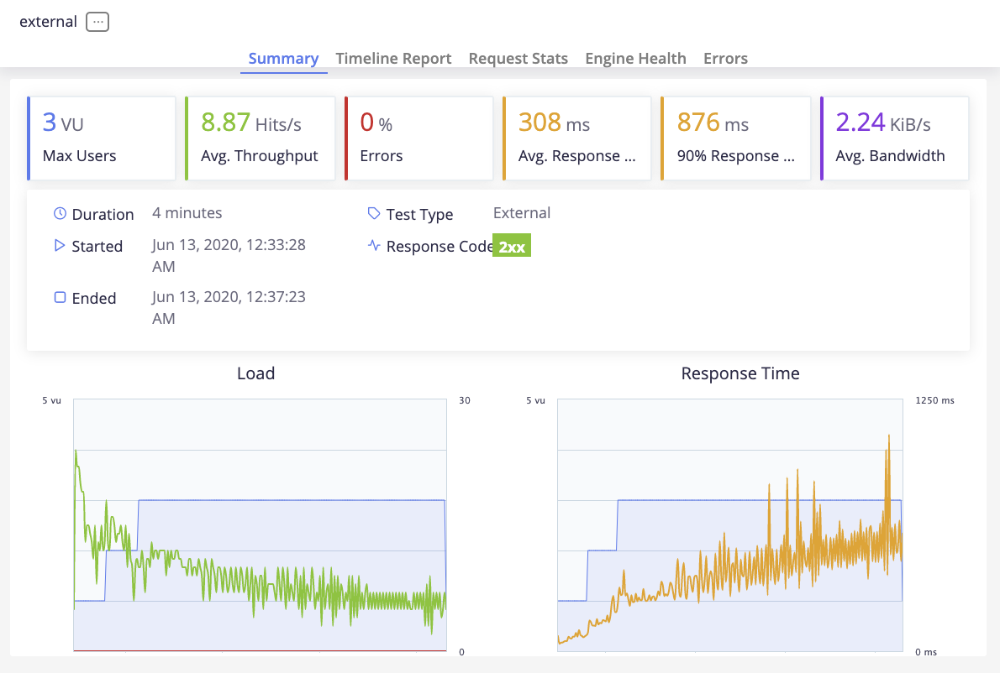

# Nameko Examples

## Airship Ltd
Buying and selling quality airships since 2012


## Prerequisites of setting up Development Environment

* [VSCode as IDE](https://code.visualstudio.com/download)
* [Docker](https://www.docker.com/)
* [Brew for OSX/Linux](https://brew.sh/)
* [Miniconda](https://docs.conda.io/en/latest/miniconda.html)

## Setup

### Setting up environment

* Create conda environment
```ssh
$ conda env create -f environment_dev.yml
```
* To activate environment ()
```ssh
$ conda activate namekoexample

// all commands after activation will have the right binaries references. You must always be in this environment to run and debug this project
```

* To deactivate environment
```ssh
$ conda deactivate namekoexample

```
### Start services locally
* Activate conda environment using `conda activate namekoexample`
* Start backing services as docker containers
```ssh
(namekoexample) ./dev_run_backingsvcs.sh

// This will run rabbitmq, postgres and redis
```

* Start nameko services in one process (gateway, orders and products)
```ssh
(namekoexample) ./dev_run.sh gateway.service orders.service products.service
```

* Quick `Smoke Test` to ensure the setup is working properly
```ssh
(namekoexample) ./devops/nex-smoketest.sh local 

# Example output:
Local Development
STD_APP_URL=http://localhost:8000
=== Creating a product id: the_odyssey ===
{"id": "the_odyssey"}
=== Getting product id: the_odyssey ===
{
  "in_stock": 10,
  "id": "the_odyssey",
  "maximum_speed": 5,
  "passenger_capacity": 101,
  "title": "The Odyssey"
}
=== Creating Order ===
{"id": 3}
=== Getting Order ===
{
  "order_details": [
    {
      "image": "http://www.example.com/airship/images/the_odyssey.jpg",
      "price": "100000.99",
      "product_id": "the_odyssey",
      "id": 3,
      "product": {
        "in_stock": 9,
        "id": "the_odyssey",
        "maximum_speed": 5,
        "passenger_capacity": 101,
        "title": "The Odyssey"
      },
      "quantity": 1
    }
  ],
  "id": 3
}
```

* Unit Test
```ssh
(namekoexample) ./dev_pytest.sh
```

## Debugging via VSCode IDE

* Start nameko services in debugging mode

```ssh
(namekoexample) DEBUG=1 ./dev_run.sh gateway.service orders.service products.service

// Same output
Connection to localhost port 15672 [tcp/*] succeeded!
Connection to localhost port 6379 [tcp/*] succeeded!
Connection to localhost port 5432 [tcp/postgresql] succeeded!
INFO  [alembic.runtime.migration] Context impl PostgresqlImpl.
INFO  [alembic.runtime.migration] Will assume transactional DDL.
{}

nameko service in debug mode. please connect to port 5678 to start service
```

* Attach debugging process via `Python Debug: Connect` in VSCode


## Performance Test via Taurus BlazeMeter locally

* Start nameko services
* Start performance script
```ssh
(namekoexample) ./test/nex-bzt.sh local

// This will run by default 3 users, for 3 minutes with 1 minute ramp-up time
```
